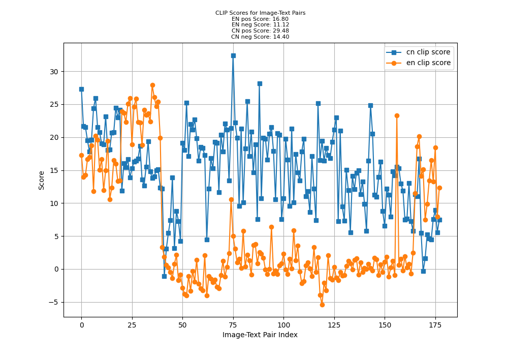

## 项目概述 / Project Overview

我写这个项目是因为目前文生图/图生图的评价教程中使用的clip都是基于英文的，如[Hugging Face](https://huggingface.co/docs/diffusers/main/en/conceptual/evaluation#image-conditioned-text-to-image-generation)。

I initiated this project because the current evaluation tutorials for text-to-image/image-to-image generation using English-training CLIP, such as the one available at [Hugging Face](https://huggingface.co/docs/diffusers/main/en/conceptual/evaluation#image-conditioned-text-to-image-generation).

因此我在这里写这个基于中文clip的评价GAN/diffusion model的项目，另一方面我也担心我的代码有自己未发现的bug，这也是我写这个项目的原因之一，欢迎各位指教。

Therefore, I developed this project to evaluate GAN/diffusion models using Chinese-training CLIP. Additionally, I am concerned that there might be bugs in my code that I haven't discovered yet, which is another reason for creating this project. Any feedback and suggestions are highly appreciated.

## 使用方法 / Usage

### 生成clip score / Generating CLIP Score

计算`clip_score`的原理是计算图片和`prompt`的相似度`prompt_score`，以及图片和`neg_prompt`的相似度`neg_prompt_score`，然后计算两者的差值，即`prompt_score - neg_prompt_score`，`prompt_score`和`neg_prompt_score`的计算公式相同，只是计算的时候输入的`prompt text`不同。本项目会同时计算中文clip score和英文clip score。考虑到prompt可能超过77个token，我使用""zer0int/LongCLIP-GmP-ViT-L-14""而非openai的CLIP。

The principle of calculating the `clip_score` is to compute the similarity between the image and the `prompt` (`prompt_score`), as well as the similarity between the image and the `neg_prompt` (`neg_prompt_score`). Then, calculate the difference between these two scores, i.e., `prompt_score - neg_prompt_score`. The calculation formulas for `prompt_score` and `neg_prompt_score` are the same, with the only difference being the input `prompt text`. This project calculates both Chinese and English CLIP scores simultaneously. Considering that prompts may exceed 77 tokens, we use "zer0int/LongCLIP-GmP-ViT-L-14" instead of OpenAI's CLIP.

1. 组织数据 / Organize Data
在clip_score_main.py目录下建立data文件夹，该文件夹下的每个目录代表一个测试数据集，每个数据集的目录下需要包含data.json文件，组织结构如下所示：

Create a data folder in the directory of clip_score_main.py. Each subdirectory within this folder represents a test dataset, and each dataset directory should contain a data.json file. The structure is as follows:
```bash
.
|-- README.md
|-- clip_score.py
|-- clip_score_main.py
|-- data
|   |-- 1
|   |   |-- 0-0.png
|   |   |-- 1-0.png
|   |   |-- 2-0.png
|   |   |-- 3-0.png
|   |   |-- 4-0.png
|   |   |-- 5-0.png
|   |   |-- 6-0.png
|   |   |-- 7-0.png
|   |   |-- 8-0.png
|   |   |-- 9-0.png
|   |   `-- data.json
|   `-- 2
|       |-- 0-0.png
|       |-- 1-0.png
|       |-- 2-0.png
|       |-- 3-0.png
|       |-- 4-0.png
|       |-- 5-0.png
|       |-- 6-0.png
|       |-- 7-0.png
|       |-- 8-0.png
|       |-- 9-0.png
|       `-- data.json
`-- prompt_generated.csv
```
data.json描述同目录下所有图片的prompt，内容如下所示，如果没有neg_prompt，则不填写neg_prompt

data.json describes the prompts for all images in the same directory. The content is shown below. If there is no neg_prompt, leave the neg_prompt field empty.
```json
[
    {
        "img_path": "data/1/0-0.png",
        "prompt": "tome game, Makoto Shinkai, in the style of anime, comic style, 1girl, waist-up pose in standing position: 1.1, occupying 50% of the frame, look at camera, soft lighting, dreamy atmosphere, masterpiece, 黑长直，少女，傻白甜，明亮大眼睛，简单T恤，背着书包，樱花树下",
        "neg_prompt": "ealistic, out of frame:1.1, worst quality, low quality, normal quality, nsfw, glitch, deformed, mutated, disfigured, bad hands, signature, watermark, text, error, jpeg artifacts, blurry, overexposed, high-contrast, bad-contrast, pattern, duplicate, bad hand, missing fingers"
    },
    {
        "img_path": "data/1/1-0.png",
        "prompt": "tome game, Makoto Shinkai, in the style of anime, comic style, 1girl, waist-up pose in standing position: 1.1, occupying 50% of the frame, look at camera, soft lighting, dreamy atmosphere, masterpiece, 丸子头，浅棕色头发，生气表情，眉头微蹙，宽松毛衣，下雨街道",
        "neg_prompt": "ealistic, out of frame:1.1, worst quality, low quality, normal quality, nsfw, glitch, deformed, mutated, disfigured, bad hands, signature, watermark, text, error, jpeg artifacts, blurry, overexposed, high-contrast, bad-contrast, pattern, duplicate, bad hand, missing fingers"
    }
]
```
2. 运行 / Run
```bash
python3 clip_score_main.py #请直接运行该命令，避免遇到相对路径相关的问题
```
默认`batch size`为4，如果想要修改`batch size`，可以在clip_score_main.py中修改。运行完成后，会在data/xxx/目录下生成**clip_scores.png**文件，该文件会展示每个数据集的clip score。
以下是clip_scores.png的示例：

The default `batch size` is 4. If you want to modify the `batch size`, you can do so in clip_score_main.py. After running, a **clip_scores.png** file will be generated in the data/xxx/ directory, which will display the clip score for each dataset.
Here's an example of clip_scores.png:



这个图表展示了数据集xxx中每个图像-文本对的CLIP分数。您可以看到中文（cn）和英文（en）的CLIP分数随图像-文本对索引的变化。图表上方的标题还包含了英文和中文的平均正面和负面分数。

This chart displays the CLIP scores for each image-text pair in dataset xxx. You can see how the CLIP scores for Chinese (cn) and English (en) vary with the image-text pair index. The title above the chart also includes the average positive and negative scores for both English and Chinese.